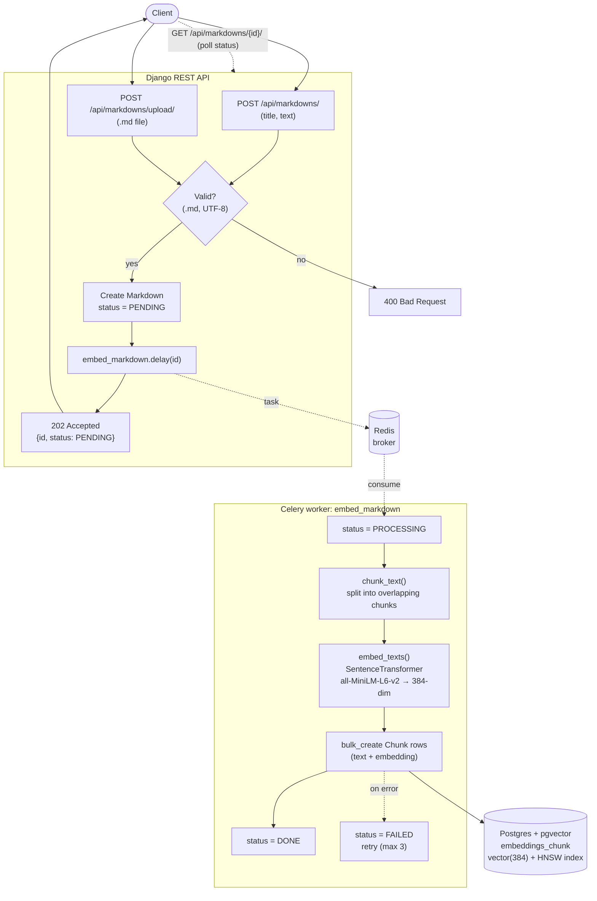

# markdown-manager

A Django REST Framework service that ingests text, splits it into overlapping
chunks, embeds each chunk with a local model, and stores the vectors in Postgres
(`pgvector`) for semantic similarity search. Embedding runs asynchronously via
Celery + Redis.

## Architecture

Flow for embedding a `.md` file or raw text:



## Setup

```bash
# 1. Infra (Postgres w/ pgvector + Redis)
docker-compose up -d

# 2. Python deps
python -m venv .venv && source .venv/bin/activate
pip install -r requirements.txt

# 3. Config + DB
cp .env.example .env
python manage.py migrate
```

## Run

```bash
# Terminal A — API
python manage.py runserver

# Terminal B — Celery worker
celery -A config worker -l info
```

> **macOS:** the default `prefork` pool `fork()`s workers, and PyTorch /
> sentence-transformers is not fork-safe on macOS — the worker crashes with
> `SIGABRT` / `WorkerLostError`. Run the worker without forking instead:
>
> ```bash
> celery -A config worker -l info --pool=solo         # single process
> celery -A config worker -l info --pool=threads --concurrency=4  # concurrent
> ```
>
> Linux (incl. Docker) is unaffected — `prefork` works there.

## API

Markdown is grouped into **projects**; ingest and search are scoped per project.

| Method | Path                        | Description                                    |
|--------|-----------------------------|------------------------------------------------|
| GET/POST | `/api/projects/`          | List / create projects (`{name, description?}`) |
| GET/PUT/DELETE | `/api/projects/{id}/` | Retrieve / update / delete a project          |
| POST   | `/api/markdowns/`           | Submit `{project, title?, text}`; returns `202` + id + `PENDING`; embedding is enqueued |
| POST   | `/api/markdowns/upload/`    | Upload a `.md` file (multipart `file` + `project`); filename becomes the title |
| GET    | `/api/markdowns/{id}/`      | Markdown status + `chunk_count`                |
| GET    | `/api/markdowns/{id}/chunks/` | Paginated chunks for a markdown              |
| POST   | `/api/search/`              | `{query, project, top_k?}` → top-k chunks in that project by cosine distance |

### Admin

Projects (and markdowns/chunks) can also be managed in the Django admin:

```bash
python manage.py migrate
python manage.py createsuperuser
python manage.py runserver   # then open http://localhost:8000/admin/
```

### Interactive docs

The OpenAPI spec lives in `spec/openapi.yaml` and is served by a Swagger UI
container:

```bash
docker-compose up -d swagger-ui   # then open http://localhost:8080
```

### Database monitoring (PgHero)

[PgHero](https://github.com/ankane/pghero) gives a dashboard for the Postgres /
pgvector database — index usage, table/index sizes, live queries, and slow-query
stats.

```bash
docker-compose up -d pghero       # then open http://localhost:8081
```

Query stats rely on the `pg_stat_statements` extension. Postgres is started with
`shared_preload_libraries=pg_stat_statements`; enable the extension once:

```bash
docker-compose exec postgres psql -U vec -d vec -c "CREATE EXTENSION IF NOT EXISTS pg_stat_statements;"
```

### Backups

Daily logical backups run via the `db-backup` service (gzipped `pg_dump`,
7 daily / 5 weekly / 6 monthly retention) into `./backups`, with off-site
fan-out and restore scripts under `scripts/`. See **[docs/backup.md](docs/backup.md)**
for the full on-prem backup/restore runbook.

```bash
docker-compose up -d db-backup
```

### Example

```bash
# Create a project (grab its id)
curl -X POST localhost:8000/api/projects/ \
  -H 'Content-Type: application/json' \
  -d '{"name":"bikes"}'

# Ingest (JSON)
curl -X POST localhost:8000/api/markdowns/ \
  -H 'Content-Type: application/json' \
  -d '{"project":"<project_id>","title":"note_1","text":"The bike color is blue."}'

# Ingest (upload a .md file)
curl -X POST localhost:8000/api/markdowns/upload/ \
  -F 'file=@note_1.md' -F 'project=<project_id>'

# Poll (until status == DONE)
curl localhost:8000/api/markdowns/<id>/

# Search (scoped to the project)
curl -X POST localhost:8000/api/search/ \
  -H 'Content-Type: application/json' \
  -d '{"query":"what is the color of bike?","project":"<project_id>","top_k":3}'
```

## Tests

```bash
# Chunking tests run without infra. The API/search tests need the Postgres
# (pgvector) database from docker-compose and run the embedding task eagerly.
python manage.py test
```

## Notes

- Embedding dimension (384) is pinned to `all-MiniLM-L6-v2`. Changing the model
  (`EMBEDDING_MODEL_NAME`) means a new migration + re-embedding existing chunks.
- v1 accepts raw text only — no auth, file upload, or PDF parsing.

